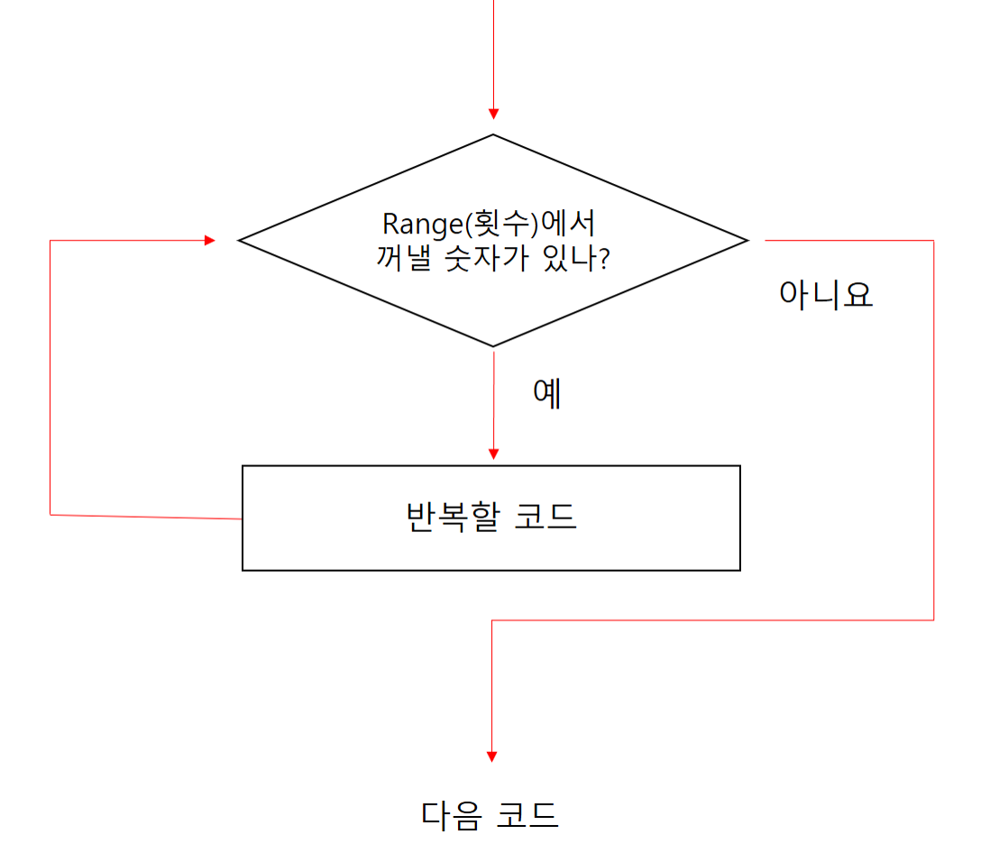
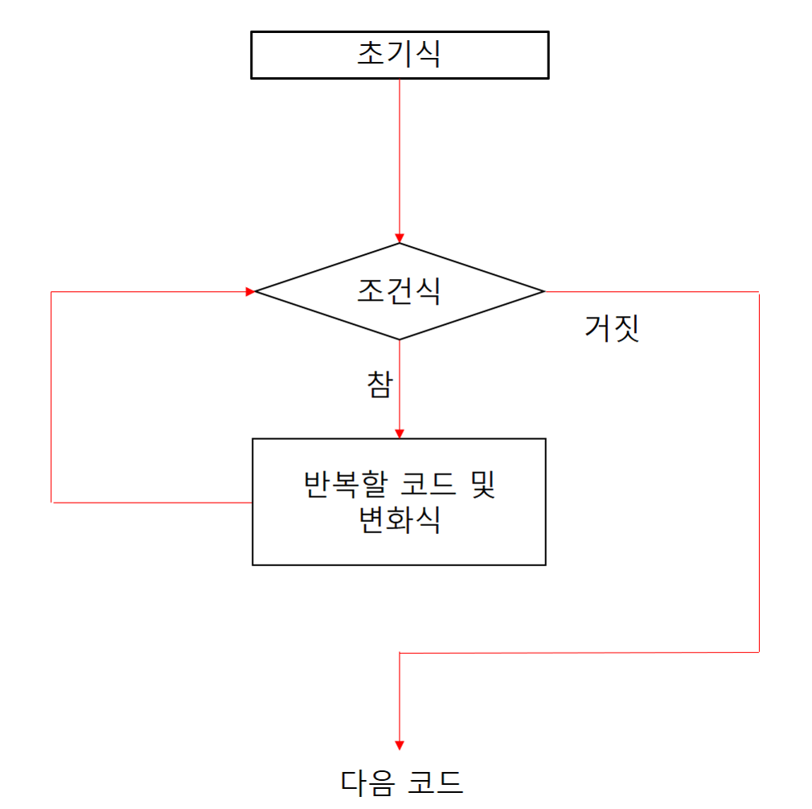

# 반복문
반복되는 작업을 간단하게 처리하기 위해 반복문이라는 것을 사용합니다.

## for 반복문

#### range함수 이용
range함수를 이용한 for문의 모양입니다.
```python
for 변수 in range(횟수):
    반복할 코드
↑↑↑↑ (들여쓰기 네칸)
```
위 모양의 예제입니다.
```python
for i in range(5):
    print('Hello, world!')
```
실행결과
```python
Hello, world
Hello, world
Hello, world
Hello, world
Hello, world
```
위 for 반복문의 동작과정을 그림으로 표현하면 다음과 같습니다.
</img>

i의 값과 실행중인 횟수를 알기위해 출력할 문자열 뒤에 i의 값을 넣었습니다.
```python
for i in range(5):
    print('Hello, world!', i)
```
실행결과
```python
Hello, world! 0
Hello, world! 1
Hello, world! 2
Hello, world! 3
Hello, world! 4
```
즉 range에서 꺼낸 숫자는 변수 i에 저장되며 반복할 코드에서 아용할 수 있습니다.(i는 계속 증가합니다.)
i의 값(range의 값)을 반복때마다 감소시키기 위해 range(횟수)부분을 range(10, 0, -1), reversed(range(10))등등으로 만들수도 있습니다.

#### 리스트, 튜플, 문자열 등을 이용한 for반복문
* 리스트의 경우입니다.
```python
a = [10, 20, 30, 40, 50]
for i in a:
    print(i)
```
실행결과
```python
10
20
30
40
50
```
* 튜플의 경우입니다.
```python
fruits = ('apple', 'orange', 'grape')
for fruit in fruits:
    print(fruit)
```
실행결과
```python
apple
orange
grape
```
* 문자열의 경우입니다.
```python
for letter in 'Python':
    print(letter, end=' ')
```
실행결과
```python
P y t h o n
위 문자열을 이용한 for문의 코드중 print()줄에서 end=' '을 지정했으므로 줄바꿈이 되지않고, 각 문자가 공백으로 띄워져서 출력됩니다.
'Python'부분을 reversed('Python')으로 바꾸어 출력을 반대로 나오게 할수도 있습니다.
```


## while반복문
while문의 모양입니다.
```python
i = 0                              # 초기식
while i < 100:                     # while 조건식(조건 충족시 반복할 코드 실행)
    print('hello. world!')         # 반복할 코드
    i += 1                         # 변화식
```

</img>
